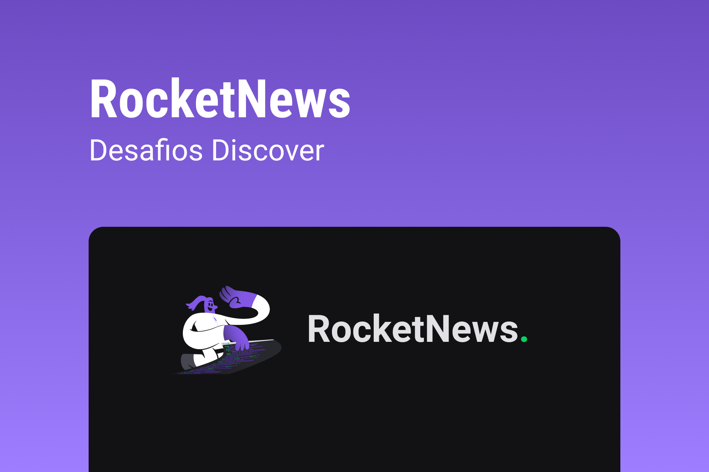

<h1 align="center"> RocketNews </h1>

RocketNews é um desafio da trilha de estudos do discover exclusivo e gratuito, promovido pela Rocketseat para ensino de tecnologias WEB.  

  <a href="#-tecnologias">Tecnologias</a>&nbsp;&nbsp;&nbsp;|&nbsp;&nbsp;&nbsp;
  <a href="#-projeto">Projeto</a>&nbsp;&nbsp;&nbsp;|&nbsp;&nbsp;&nbsp;
  <a href="#-layout">Layout</a>&nbsp;&nbsp;&nbsp;|&nbsp;&nbsp;&nbsp;
  <a href="#memo-licença">Licença</a>

  

 

  

## 🚀 Tecnologias

Esse projeto foi desenvolvido com as seguintes tecnologias:

- HTML e CSS
- Git e Github
- Figma

## 💻 Projeto

O RocketNews é um app de noticias sobre o universo Rocketseat, e tudo o que precisa para começar o dia melhor.  
          Perfeito para se preparar para codar ☕

- [Acesse o projeto finalizado, online](https://guilherme-nicoletti.github.io/RocketNews/)

## 🔖 Layout

Você pode visualizar o layout do projeto através [DESSE LINK](https://www.figma.com/file/KaIVuB6lvq9iIbkbBoGERJ/DD-%2F-RocketNews-(Copy)?node-id=3%3A2&t=7cTtqcBV5X5iaQH1-0). É necessário ter conta no [Figma](https://figma.com) para acessá-lo.

## :memo: Licença

Esse projeto está sob a licença MIT.

---

Feito com ♥ by Rocketseat :wave: [Participe da nossa comunidade!](https://discord.gg/rocketseat)